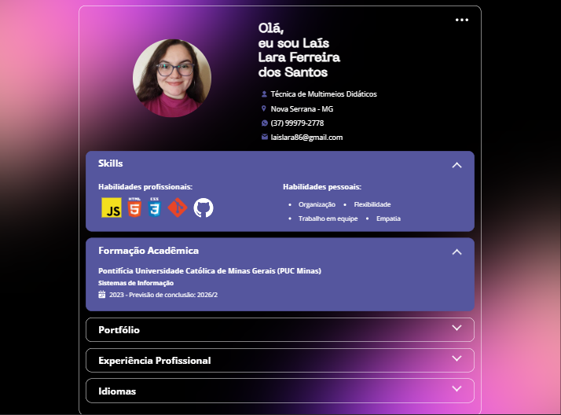

# Portfólio Profissional
Este é o meu projeto de portfólio profissional, desenvolvido para apresentar meus projetos, habilidades e experiências de forma interativa e visualmente atrativa.
O projeto foi criado utilizando **HTML**, **CSS** e **JavaScript**.


## 🖥️ Demonstração
Você pode acessar o portfólio por meio do link: [https://lais-lfs.github.io/Portfolio/](https://lais-lfs.github.io/Portfolio/)


## 🚀 Funcionalidades

- **Apresentação pessoal** com uma breve introdução sobre mim e principais formas de contato.
- **Habilidades técnicas e pessoais** organizadas de forma clara e visual.
- **Formação acadêmica** com as informações sobre curso de graduação em andamento.
- **Seção de projetos** para exibir os principais trabalhos realizados, com títulos e links.
- **Experiências de trabalho** na área de tecnologia, com informações sobre o cargo, empresa, período e breve descrição das tarefas realizadas.
- **Idiomas** falados de forma clara.
<!-- - **Contato** para facilitar conexões via redes sociais ou e-mail. -->



## 🛠️ Tecnologias Utilizadas

- **HTML**: Estrutura do site.
- **CSS**: Estilização, layout responsivo e adição de ícones.
- **JavaScript**: Interatividade, como animações, manipulação dos elementos e dinamização das informações vindas da API.
- **JSON**: Criação  e formatação de uma API simples, contendo todas as informações do portfólio.

<!-- ## 📂 Estrutura do Projeto

```plaintext
/
├── index.html       # Página principal
├── styles/          # Arquivos CSS
│   ├── main.css     # Estilos principais
│   ├── responsive.css # Estilos para dispositivos móveis
├── scripts/         # Arquivos JavaScript
│   ├── main.js      # Script principal
├── assets/          # Recursos como imagens e ícones
│   ├── img/         # Imagens do portfólio
│   ├── icons/       # Ícones utilizados
```
-->

## 🌟 Objetivos do Projeto
- Criar um portfólio moderno e responsivo.
- Praticar as habilidades em HTML, CSS, JavaScript e APIs.
- Servir como plataforma para mostrar meus trabalhos a potenciais empregadores.

## 💡 Melhorias Futuras
- Adicionar informações visuais na seção do portfólio para mostrar os projetos de forma mais interativa.
- Adicionar um sistema de blog para publicar conteúdos técnicos.
- Utilizar React ou outra biblioteca/framework para modernizar o projeto.


## 📧 Contato
Fique à vontade para entrar em contato comigo:
- Email: laislara86@gmail.com
- LinkedIn: [https://www.linkedin.com/in/lais-lara/](https://www.linkedin.com/in/lais-lara/)
- GitHub: [https://github.com/Lais-lfs](https://github.com/Lais-lfs)


Desenvolvido com por Laís Lara Ferreira.
